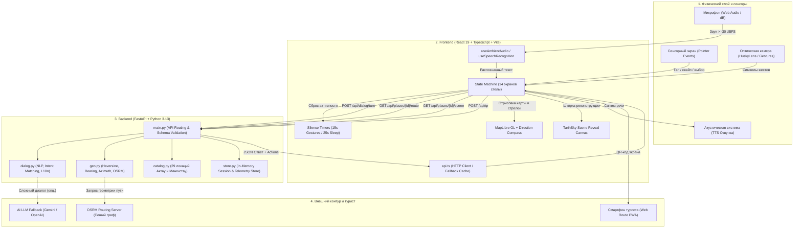
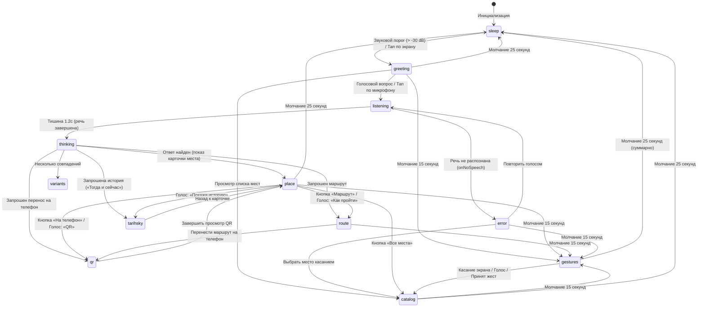
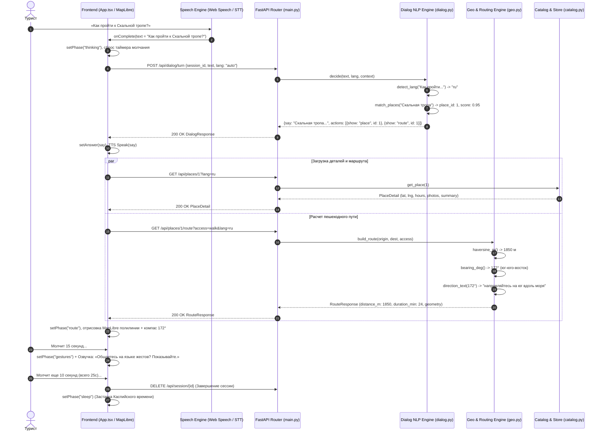
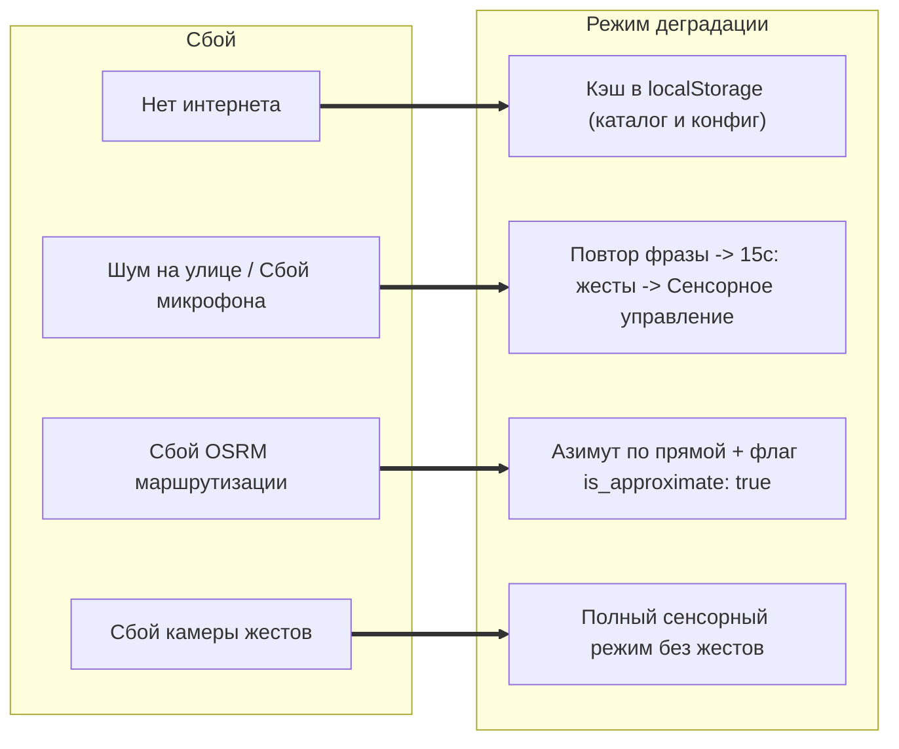

# 🚀 BaGdar — Интерактивная туристическая стела Актау и Мангистау

> **BaGdar** («Бағдар» — направление, ориентир) — цифровой голосовой гид на городской набережной Каспийского моря. Обеспечивает мгновенную пешеходную навигацию, голосовой диалог на казахском, русском и английском языках, историческую шторку «Тогда и сейчас» (TarihSky), оптический интерфейс жестов и перенос маршрута на смартфон по QR-коду.

---

## 🗺 Карта флоу: Сквозная архитектура (End-to-End Flow Map)

На схеме показано взаимодействие между физическим слоем стелы, клиентским приложением (React), сервером обработки (FastAPI) и внешними сервисами.



---

## 🧭 Карта состояний и таймеров фронтенда (Frontend State & Timeout Flow)

Стела работает как строгий конечный автомат (State Machine). Управление таймерами активности гарантирует, что стела не остаётся зависшей в промежуточных экранах:

- **15 секунд тишины** → запрос перехода на **язык жестов** (`gestures`) с голосовым дублированием.
- **25 секунд тишины** → завершение сессии и переход в **режим сна** (`sleep`).
- **Любое касание или речь** → мгновенный сброс таймера и возврат в активный режим.



---

## ⚡ Диаграмма последовательности: Голосовой запрос туриста (Voice Turn Sequence)

Пошаговый сценарий от момента, когда турист произносит вопрос, до прокладки пешеходного маршрута на карте:



---

## 📊 Матрица функций Frontend ↔ Backend (Function Map)

В таблице представлена полная карта привязки функций клиентской части к эндпоинтам и алгоритмам сервера:

| Пользовательский флоу | Frontend функция / хук | HTTP Эндпоинт | Backend функция / модуль | Источник данных / Алгоритм | Результат на стеле |
|---|---|---|---|---|---|
| **Инициализация стелы** | `boot()` в `App.tsx`<br>`api.getConfig()` | `GET /api/config` | `get_config()` в `main.py` | Переменные окружения, координаты стелы `ORIGIN_LAT/LNG` | Локация `43.662252, 51.133075`, языки `kk/ru/en`, screen_id |
| **Каталог 29 мест** | `api.getPlaces(lang)` | `GET /api/places` | `get_places()` в `main.py`<br>`load_places()` в `catalog.py` | `data/places/places.json`<br>29 мест Актау и Мангистау | Сетка карточек по 10 категориям (парк, набережная, отели, еда, туры) |
| **Голосовой диалог** | `submitTurn(text)`<br>`useSpeechRecognition` | `POST /api/dialog/turn` | `dialog_turn()` в `main.py`<br>`decide()` в `dialog.py` | Левенштейн / fuzzy-поиск, классификатор интентов, мультиязычность | Ответ ассистента в TTS, цепочка действий `actions[]` |
| **Карточка места** | `api.getPlace(id, lang)` | `GET /api/places/{id}` | `get_place_by_id()` в `main.py`<br>`opening_state()` | `places.json`<br>Проверка времени работы и статуса `is_open_now` | Фото, статус открытия, описание, кнопки навигации |
| **Маршрут и навигация** | `api.getRoute(id, access)` | `GET /api/places/{id}/route` | `get_route()` в `main.py`<br>`haversine_m()`, `bearing_deg()` в `geo.py` | OSRM графовый роутер с фоллбэком на ортодромический азимут | Синяя линия пути на MapLibre, метры, минуты, стрелка компаса |
| **TarihSky («Тогда/Сейчас»)** | `api.getScene(id, lang)` | `GET /api/places/{id}/scene` | `get_scene()` в `main.py` | Архивные фото и современный вид (`then_url`, `now_url`) | Интерактивный ползунок исторической реконструкции |
| **Перенос на смартфон** | `api.postQr(payload)` | `POST /api/qr` | `create_qr()` в `main.py`<br>`build_mobile_url()` | Генерация защищенного токена и мобильной ссылки | QR-код на экране с обратным отсчетом 60 секунд |
| **Телеметрия стелы** | `postEvent(type)` | `POST /api/events` | `log_event()` в `main.py`<br>`store.append_event()` | Хранилище событий в памяти / SQLite | Логирование кликов, просмотров, сканирований и сессий |
| **Таймер молчания (15с)** | `useEffect(timer)` в `App.tsx` | *Локальный автомат* | `copy.gesture` в `i18n.ts` | Сравнение `Date.now() - lastActivity >= 15` | Переключение на `PageGestures`, озвучка жестового приглашения |
| **Таймер сна (25с)** | `endSession(true)` в `App.tsx` | `DELETE /api/session/{id}` | `end_session()` в `main.py`<br>`store.end_session()` | Сравнение `Date.now() - lastActivity >= 25` | Озвучка прощания, очистка состояния, `PageSleep` |

---

## 🛡 Отказоустойчивость и сценарии деградации (Graceful Degradation)

Стела спроектирована для надежной работы в автономных условиях на улице:



---

## 🏛 Каталог объектов (Актау и Мангистау)

В систему заложен полный верифицированный каталог из 29 ключевых объектов региона (файл `data/places/places.json`):

1. **Городской променад и прибрежная зона**: Скальная тропа, Набережная 15-го мкр, Амфитеатр, Мыс Меловой (Маяк), Парк Акбота.
2. **Культура и история**: Мангистауский областной историко-краеведческий музей, Мечеть Бекет-Ата (городская).
3. **Шопинг и гастрономия**: ТРК «Актау», ТРК «Гум», Рынок «Жёлтый» (Шыгыс), Каспийский ресторан «Aidyn», Чайхана «Mangi», Fish Bar у пирса.
4. **Отели**: Rixos Water World Aktau, Caspian Riviera Grand Palace, Renaissance Aktau, Grand Hotel Victory, Holiday Inn Aktau.
5. **Транспортные узлы**: Международный аэропорт Актау (SCO), Ж/Д вокзал Мангышлак (Мангистау), Автовокзал 28-й микрорайон, Морской порт Актау.
6. **Экспедиционные туры по Мангистау**: Урочище Бозжыра, Впадина Каракия, Долина шаров Торыш, Мечеть Шакпак-Ата, Мечеть Бекет-Ата (Огланды), Каньон Ыбыкты, Каспийская лагуна Саура.

---

## 🛠 Технологический стек

- **Frontend**: React 19, TypeScript, Vite, MapLibre GL, Web Audio API, Web Speech API.
- **Backend**: Python 3.13, FastAPI, Pydantic v2, Uvicorn, OSRM Integration.
- **Данные и геометрия**: GeoJSON, Haversine formula, ортодромический азимут, SQLite/In-memory store.
- **Дизайн**: Liquid Glass Design System, CSS Variables, Manrope & Newsreader типографика.

---

## 🚀 Быстрый запуск

### 1. Запуск Backend

```bash
cd backend
python -m pip install -r requirements.txt
python -m uvicorn app.main:app --reload --port 8000
```

Проверка тестов:
```bash
$env:PYTHONPATH="backend"; python -m pytest backend/tests
```

### 2. Запуск Frontend

```bash
cd frontend
npm install
npm run dev
```

Приложение откроется по адресу `http://localhost:5173`.
Сборка для продакшена:
```bash
npm run build
```

---

## 👥 Команда проекта

| Роль | Участник | Зона ответственности |
|---|---|---|
| **Tech Lead** | [@Dyman17](https://github.com/Dyman17) | Архитектура, ревью, контракты, интеграция и деплой |
| **Backend** | [@RKydyrali](https://github.com/RKydyrali) | FastAPI, каталог, маршруты, NLP-диалог, QR |
| **Frontend** | [@yernurge](https://github.com/yernurge) | React-экраны стелы, MapLibre, аудио-слой, TarihSky, тайм-ауты |
